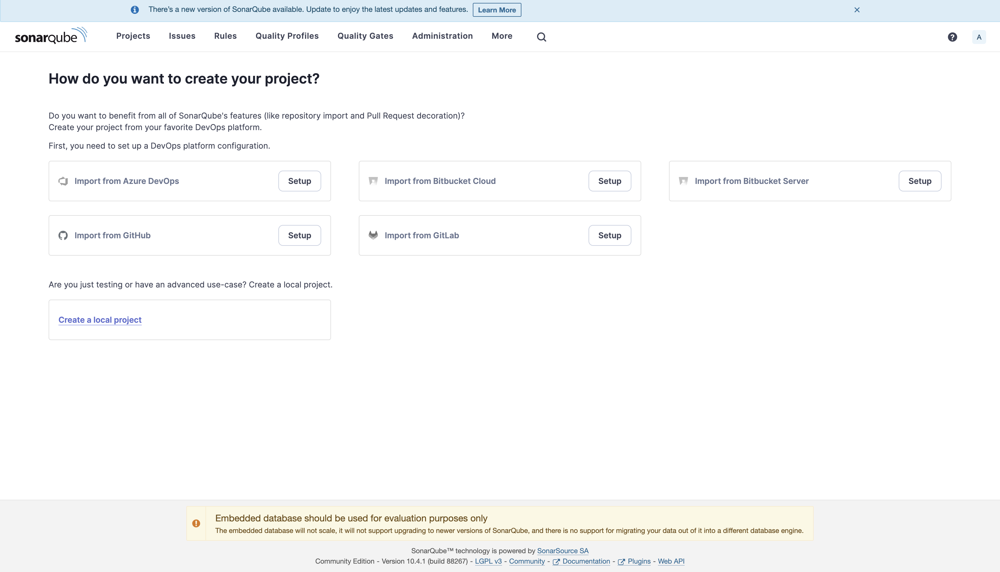
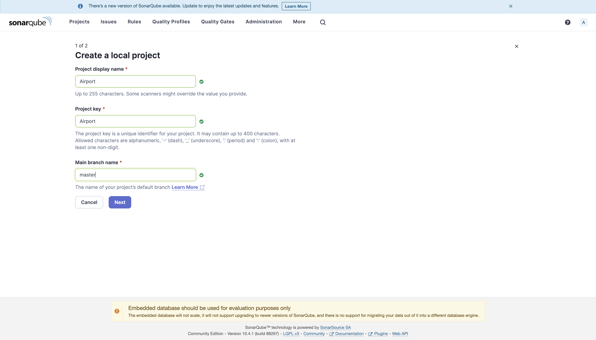
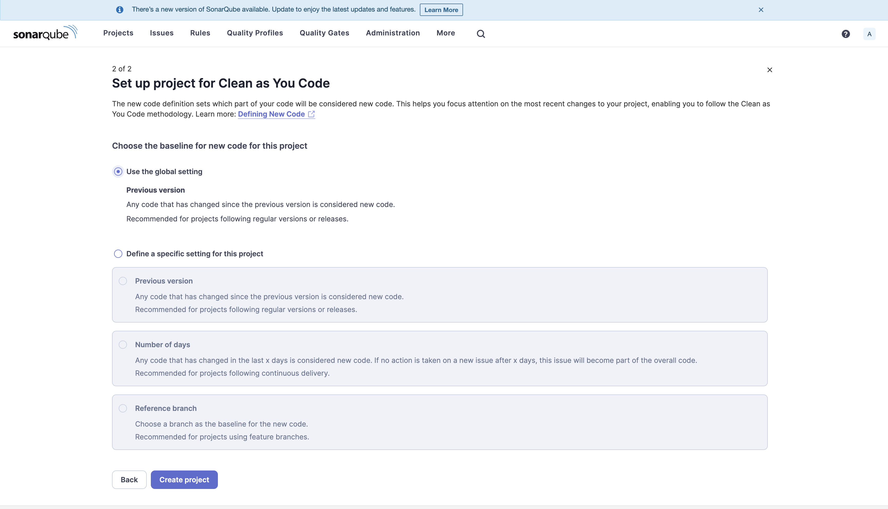
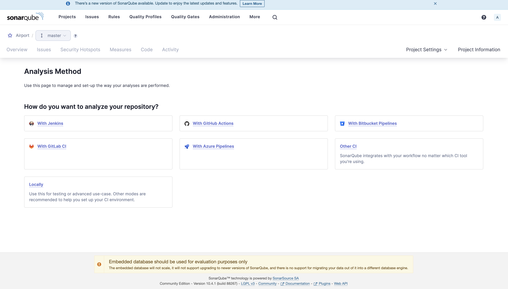
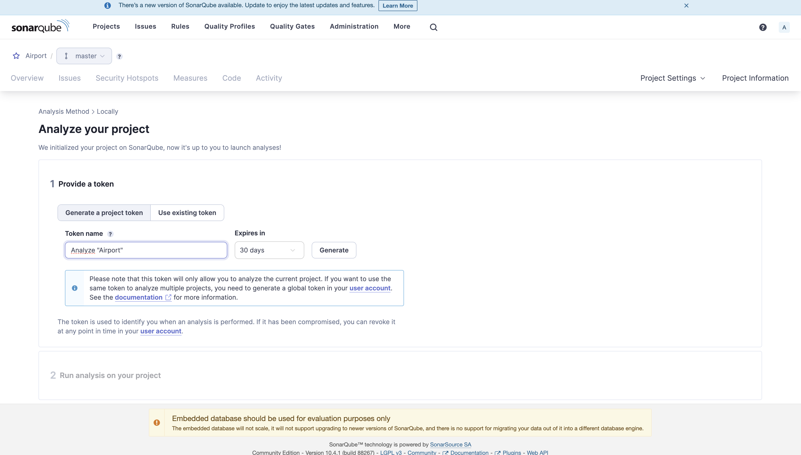
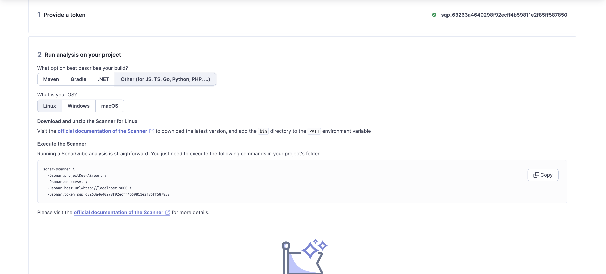

# System Pre-requisites

Go lang: 1.22.1
Docker
Docker-compose

### Steps to setup postgres db locally using docker-compose

- Create a `.env` file in the project folder
- Add the following attributes in the `.env` file
```
        export AIRPORT_POSTGRES_USER=<postgres-username>
        export AIRPORT_POSTGRES_PASSWORD=<postgres-password>
        export AIRPORT_HOST=localhost
        export AIRPORT_DB_NAME=<postgres-dbname>
        export AIRPORT_PORT=5432
        export AIRPORT_SSL_MODE=disable
```
## Contributing to the codebase

- To install required dependencies, run: `make install`
- To initiate the database, run: `make docker`
- To clean, test, initiate docker container and build app in sequence, run: `make all`
- To run all tests, run: `make test`
- To create an executable file, run: `make build`
- To run the packaged application, run: `./airport-app-backend`
- To run app without packaging, run: `make bootrun`
- The running app can be accessed [here](https://0.0.0.0:8080/)
- The Jaeger UI can be accessed [here](http://localhost:16686)

## Steps to setup SonarQube locally

- run `make docker`
- Hit [this link](http://localhost:9000/) [Credentials --> Username : Admin, Password : Admin]
- Create a local project named `Airport` with project key as `Airport` 
- Change `main` to `master` 
- Select an option of your choice for the second step 
- Click `Create project`
- Select `locally` 
- Give a token name of your choice and click `generate` (COPY THE TOKEN) 
- Select `other` for `Run analysis on your project` 
- Install `sonar-scanner` using [homebrew](https://brew.sh/)
- Create a file named `sonar-project.properties` in the project root. Modify and paste the following lines
     `sonar.projectKey=Airport
      sonar.projectName=Airport
      sonar.sources=.
      sonar.language=go
      sonar.sourceEncoding=UTF-8
      sonar.go.coverage.reportPaths=coverage.out
      sonar.coverage.exclusions=mocks/**,server/**,certs/**,config/**,database/**, **/*_test.go, **/main.go
      sonar.login=admin
      sonar.password= <YOUR PASSWORD>
      sonar.token=sqp_63263a4640298f92ecff4b59811e2f85ff587850 (REPLACE THIS VALUE WITH YOUR TOKEN COPIED PREVIOUSLY)`
- Run `make sonar-scan` to do analysis.
