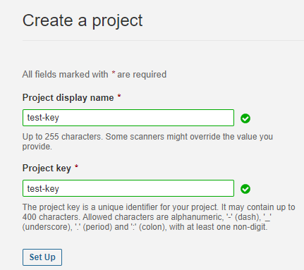
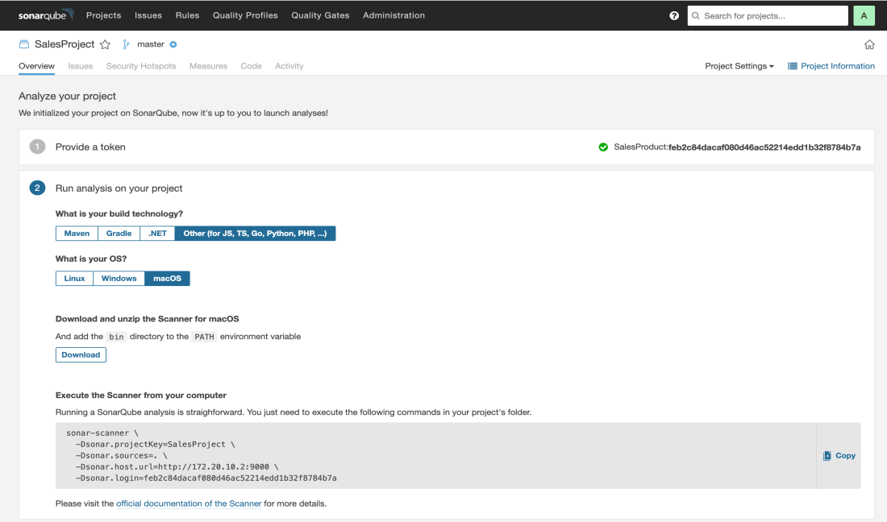

##Run Test
    -Navigate to middleware(cd middleware)
    -Use the following command to run the tests:
        go test

# System Pre-requisites

Go lang: 1.22.1
Docker
Docker-compose

### Steps to setup postgres db locally using docker-compose

- Create a `.env` file in the project folder
- Add the following attributes in the `.env` file
```
        export AIRPORT_POSTGRES_USER=<postgres-username>
        export AIRPORT_POSTGRES_PASSWORD=<postgres-password>
        export AIRPORT_HOST=localhost
        export AIRPORT_DB_NAME=<postgres-dbname>
        export AIRPORT_PORT=5432
        export AIRPORT_SSL_MODE=disable
```
## Contributing to the codebase

- To initiate the database: `make docker`
- To clean, test, initiate docker container and build app in sequence: `make all`
- Run the executable file : `./airport-app-backend`
- Access the running app on [local](https://0.0.0.0:8080/)

- Install required dependencies: `make install`
- Create an executable file: `make build`
- Run all tests: `make test`

- To run app without creating a build: `make bootrun`
- Access the running app on [local](https://0.0.0.0:8080/)

-Access the Jaeger UI in [local](http://localhost:16686)

## Steps to setup SonarQube locally

- run `make docker`
- Hit this [link](http://localhost:9000/) [Credentials --> Username : Admin, Password : Admin]
- Create a local project with name as `Airport` and project key as `Airport`
- Change `main` to `master`
- Select an option of your choice for the second step
- Click `create project`.
- Select `locally`
- Give a token name of  your choice and click `generate` (COPY THE TOKEN)  
- Select `other` for `Run analysis on your project`
- Create a file and name it as `sonar-project.properties` in the project root ,Modify and paste the following lines
     `sonar.projectKey=Airport
      sonar.projectName=Airport
      sonar.sources=.
      sonar.language=go
      sonar.sourceEncoding=UTF-8
      sonar.go.coverage.reportPaths=coverage.out
      sonar.coverage.exclusions=mocks/**,services/**,models/**,server/**,certs/**,config/**,database/**
      sonar.login=admin
      sonar.password= <YOUR PASSWORD>
      sonar.token=sqp_63263a4640298f92ecff4b59811e2f85ff587850 (REPLACE THIS VALUE WITH YOUR TOKEN COPIED PREVIOUSLY)`

- Run `make sonar-scan` to do analysis.

